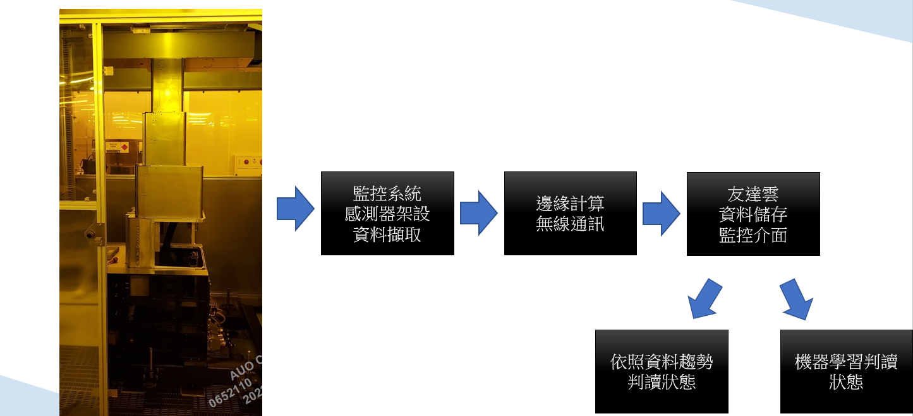

# AUOProject

   

## 系統架構  
## 如果你想快速開始並設置請參閱[Quick Start Guide](document/Quick%Start%Guide.md)

* 目標開發一個應用於晶圓搬運Robo之Z軸鋼帶壽命監控系統。
* 其系統架構可分成三個部分
  * ## [上游端](document/上游端.md)
    > 該部分主要是感測器、微處理器整合之模組
  * ## [中遊端](document/中遊端.md)
    >該部分主要是基於微處理器上開發整合資料擷取、資料處理、邊緣計算得出特徵指標、無線傳輸等功能
  * ## [下游端](document/下游端.md)
    >該部分主要是終端顯示、資料儲存、人工智慧判斷的部分
* [邊緣計算部分C語言實現API](document/API.md)
* [裝設指南-硬體篇](document/上游端.md)
* [裝設指南-Windows主機篇]
* [裝設指南-InfluxDB篇](document/Install%20InfluxDB%20windows.md)
* [裝設指南-Grafana篇](document/Install%20Grafana%20windows.md)
