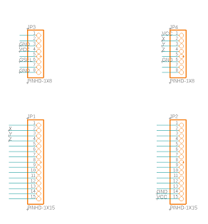

# AUOProject

   

## 系統架構  
[test](document/Hardware.md)


* 目標開發一個應用於晶圓搬運Robo之Z軸鋼帶壽命監控系統。
* 其系統架構可分成三個部分
  * 上游端
    > 該部分主要是感測器、微處理器整合之模組
  * 中遊端
    >該部分主要是基於微處理器上開發整合資料擷取、資料處理、邊緣計算得出特徵指標、無線傳輸等功能
  * 下游端
    >該部分主要是終端顯示、資料儲存、人工智慧判斷的部分
# 上游端    
監控模組3D外觀   
  
PCB Layout  
  
PCB 原理圖  
  
#I/O table  
## FXLN8371Q
|  Pin   | Name  | Eescription  | I/O  |
|  ----  | ----  | ----  | ----  |
| 1  | BYP | 內部穩壓器輸出電容連接 |Output |
| 2  | VDD | 電源電壓3.3V |Power |
| 3  | ST | 自我測試<br> • 當 ST 引腳為邏輯高電平時，加速度計進入自檢模式。 <br> • 當 ST 引腳為邏輯低電平時，加速度計進入正常工作模式。 |Input |
| 4  | EN | 電源使能引腳<br>• 當 EN 引腳為邏輯低電平時，加速度計關閉，電流最小<br>• 當 EN 引腳為邏輯高電平時，加速度計功能齊全。 |Input |
| 5  | g-Select | 滿量程範圍選擇： <br>對於部件號 FXLN8361QR1 和 FXLN8371QR1： <br>• 當g-select 引腳為邏輯低電平時，加速度計處於±8 g 模式 <br>• 當g-select 引腳為邏輯高電平時，加速度計處於±2 g 模式<br>對於部件號 FXLN8362QR1 和 FXLN8372QR1：<br>• 當g-select 引腳為邏輯低時，加速度計處於±16 g 模式<br>• 當g-select 引腳為邏輯高電平時，加速度計處於±4 g 模式 |Input |
| 6  | GND | Ground |Ground |
| 7  | GND | Ground |Ground |
| 8  | Z<sub>OUT | Z-axis analog output |Output |
| 9  | Y<sub>OUT | Y-axis analog output |Output |
| 10  | X<sub>OUT | X-axis analog output |Output |
| 11  | NC | 無內部連接，可懸空或連接到 GND |— |
| 12  | NC | 無內部連接，可懸空或連接到 GND |— |
| 13  | NC | 無內部連接，可懸空或連接到 GND |— |  

#FXLN8371Q特性  


##Connection  

|  FXLN8371Q   | ESP32  |
|  ----  | ----  | 
| X<sub>OUT  | GPIO36 |
| Y<sub>OUT  | GPIO39 |
| Y<sub>OUT  | GPIO34 |

## 靈敏度
> ```X、Y、Z Sensitivity``` : 54mV/g