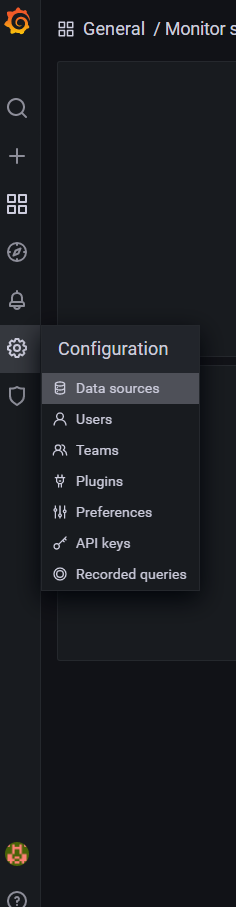
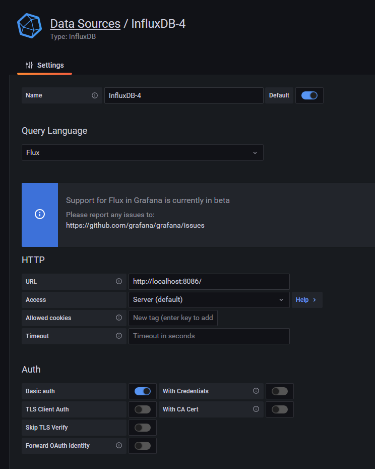
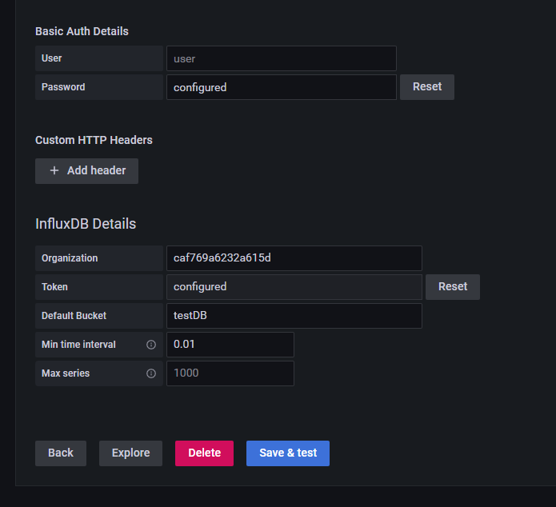

# 在Windows安裝Grfana
## 主要參照這篇[在Windows安裝Grafana](https://grafana.com/docs/grafana/latest/installation/windows/)


# Grafana初始設定
## 預設帳號密碼
> User: ```admin ```  
> Password: ```admin```  

* Grafana的預設內網埠口在3000，因此要訪問的話在瀏覽器輸入[http://localhost:3000/](http://localhost:3000/)就可以訪問了。
* 如果要在同一個區網以其他設備瀏覽，必須在Grafana運行的機器上將防火牆勾選允許訪問，操作如[該篇](https://wiki.mcneel.com/zh-tw/zoo/window7firewall)
# 至此應該已經成功運行Grafana
## 設定資料源
* 第一步在Grafana UI上點選設定資料源  
  
* 第二步選擇InfluxDB  

* 第三步 頁面往下滾，將InfluxDB端設定的資料填入，如Bucket名字、Organization token之類的訊息
