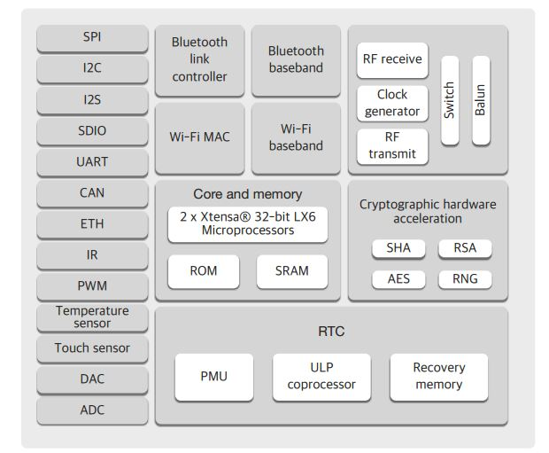

#中遊端 MCU EdgeComputing
## 中遊端工作任務主要如下
> * 負責上游感測器的資料擷取
> * 撈取到資料進行邊緣運算
> * 將資料特徵傳輸出去

在本計畫選用ESP32作為中遊節點計算與傳輸的載體
## ESP32-WROOM介紹
|  項目   | 規格  |
|  ----  | ----  | 
| 工作電壓  | 3.0V~3.6V |
| 工作電流  | 平均:80mA |
| 供電電流  | 最小:500mA |
| 工作溫度  | -40&deg;C~+85&deg;C|
|封裝尺寸| 18mm &times; 25.5mm &times; 3.1mm|
| Wi-Fi | 支持802.11 b/g/n 協議|
## ESP32-WROOM功能方塊圖

## 本專案設計遇到注意事項
* ESP32上共有兩個12bit的SARADC分別為ADC1與ADC2
* 其中Wi-Fi也就是無線傳輸功能與ADC2互斥，也就是同時只能運行一個
* 因此ESP32在選擇讀取類比訊號時必須避開ADC2腳位。
* 根據現場量測數據來看，採樣速度須達到5KHz以上，才可以看到我們希望看到的頻率範圍
* 同時對三軸進行5KHz以上速度採樣及FFT轉換，相當重的計算任務
## FreeRTOS對ESP32有良好支援
### [什麼是RTOS?](https://great-vole-c2e.notion.site/ESP32-with-RTOS-08773e8b050648a0af60a7a117fe66ee)一文中有提到，該專案為了解決採樣、邊緣計算、MQTT無線傳輸在MCU上並行執行，採用RTOS架構來編程

